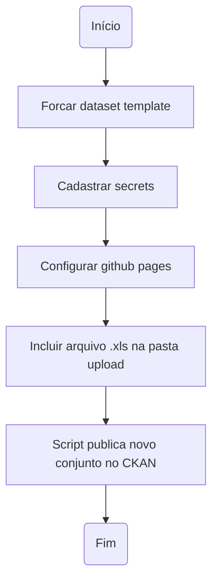

# Treinamento Dados Abertos - Novo Dataset Template

**Data:** 18/07/2023

## Participantes:

- Gabriel Dornas
- Antonio Marcel

## Gravação do encontro

## Links relacionados

- [Ata da primeira reunião mostrando setup de um projeto de abertura de dados](../20230710_publicacao_dados_comissao_etica).
- [Repositório GitHub](https://github.com/transparencia-mg/new-dataset-template).
- [Repositório criado no treinamento](https://github.com/conset-cge-mg/lista-comissoes-treinadas-spci).
- [Conjunto publicado em ambiente homologação](https://homologa.cge.mg.gov.br/dataset/lista-comissoes-treinadas-spci).

## Assuntos tratados
O new dataset template é um conjunto de automatizações desenvolvidas pela Diretoria Central de Transparência Ativa - DCTA/CGE para criação, documentação, validação e publicação (criação e atualização em instâncias do CKAN) de conjunto de dados ou datasets.

### Fluxo de execução

### Setup do projeto
- Realize o fork do projeto (utilizaremos um fork para conseguir atualizar as automatizações com maior facilidade no futuro):

- Selecione a organização a qual o novo conjunto de dados será criado e preencha o nome do novo repositório (o nome deverá ser o mesmo do conjunto que será criado na instância do CKAN).

- Cadastre Secrets para publicação em instância CKAN:

- Deverão ser criadas três secrets:

    - OWNER_ORG: Organização dentro da instância do CKAN desejada a qual o conjunto de dados será vinculado (nome disponível na url CKAN após https://ckan-instance/organization/)

    - CKAN_HOST: Instância CKAN desejada, exemplo: https://homologa.cge.mg.gov.br

    - CKAN_KEY_USUARIOGITHUB: se meu usuário GitHub é gabrielbdornas este secret será CKAN_KEY_GABRIELBDORNAS. Para o andrelamor, o secret CKAN_KEY_ANDRELAMOR

        - Necessário criar um novo API Token na instância CKAN desejada (copiar e colar o valor API TOKEN created da 4ª tela printada a seguir):
        

- Configurar permissão para Actions ler e escrever no repositório:

OBS.: Caso a permissão para Actions ler e escrever no repositório não esteja habilitada, esta configuração deverá ser feita também no nível da organização.

