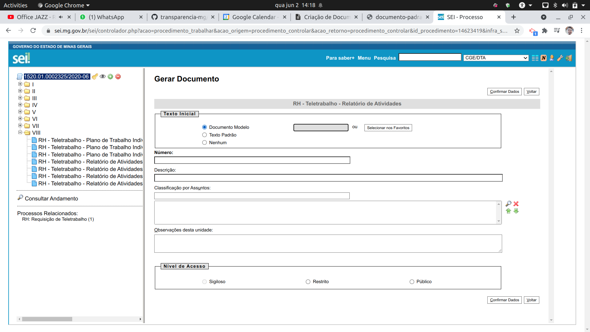

Criação de Documentos modelo no SEI
===

O Sistema [SEI](https://www.sei.mg.gov.br/) possibilita a criação de documentos modelo, facilitando assim a criação e edição de novos documentos dentro do sistema.

- Observações:
  - O modelo criado fica vinculado a um documento já criado, toda modifação neste documento base modifcará o modelo também; e
  - Caso o documento base seja excluído o modelo também o será.

- Passos para salvar o modelo:
  - Selecione o documento desejado como modelo;
  - Clique na opção disponível para salvar o modelo, conforme figura abaixo:

  - Finalize selecionando o "Grupo do Modelo" e a "Descrição"
    - Dica: Caso modelo salvo seja Plano de Trabalho ou Relatório de atividades utilize o Grupo "Plano de trabalho"

- Passos para utilizar o modelo
  - Após a escolha do tipo de documento, selecione a opção "Documento Modelo"

  - Busque o documento desejado

