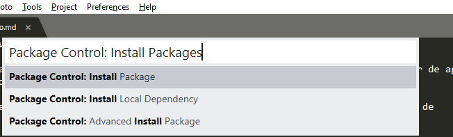
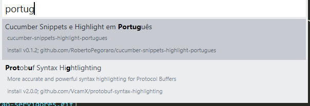

# Sublime utilidades

##  Corretor ortográfico em português - instalar e ativar

1. na tela de edição, digitar 'Ctrl + Shift + P';

2. quando abrir a caixa de seleção, digitar 'Package Control: Install Packages' e tecle enter;



3. uma nova caixa de seleção será aberta, digitar 'Portuguese', vai aparecer uma opção de dicionário em português para baixar (Cucumber)



4. na opção 'view' da barra de ferramentas - marcar 'spell check' ou utilize a tecla de atalho F6
    
5. ainda na opção 'view' - acessar 'dictionary' ao final da lista e trocar para 'português'
    - Caso portugês não esteja disponível intale o [pacote](https://packagecontrol.io/packages/LanguagePortuguese) "Language - Portuguese - Português" 


## preview - instalar e configurar atalho

1. na tela de edição, digitar 'Ctrl + Shift + P';

2. quando abrir a caixa de seleção, digitar 'Package Control: Install Packages' e tecle enter;

3. uma nova caixa de seleção será aberta, digitar 'Markdown preview', baixar o pacote;

4. na opção 'preferences' da barra de ferramentas, acessar 'key bindings'

5. para criar o atalho como no ATOM, inserir o comando abaixo entre os colchetes da parte direita da janela de 'key bindings':

````
{
        "keys": ["ctrl+shift+m"], "command": "markdown_preview", "args": {"target": "browser", "parser":"pandoc"}
    }
````


6. para acessar o preview clique 'ctrl+shift+m'. O preview será exibido no browser do navegador.
